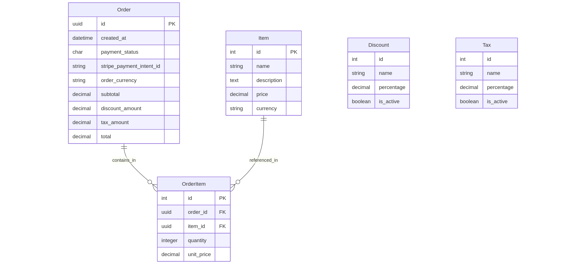
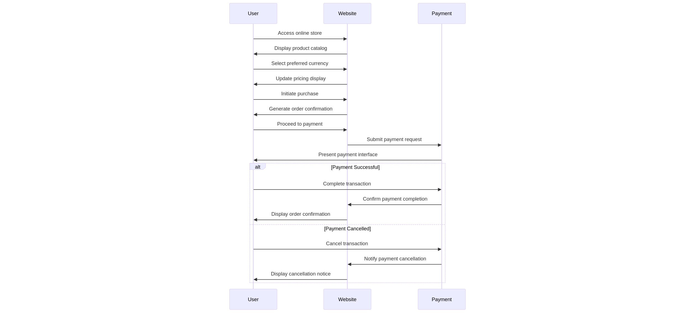
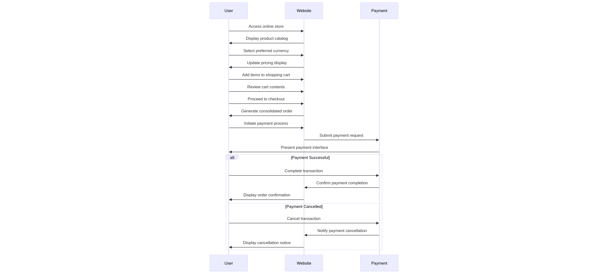
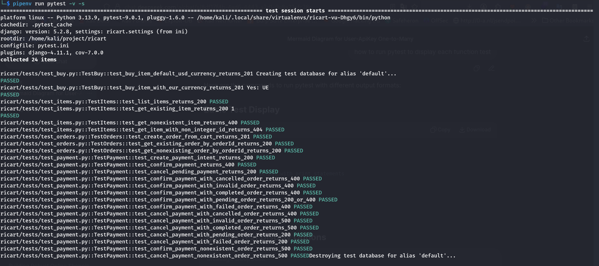

# RishatStore

A mini online shopping application with Stripe payment integration that allows customers to make purchases without creating an account. The application supports both single-item purchases and multiple-item orders through a shopping cart system.

**Note**: The cart functionality is implemented to facilitate order processing for multiple items but is not the main focus of this task.

## Quick Setup


```bash
git clone https://github.com/cyb3rkh4l1d/rishatstore.git
cd rishatstore
mv .env.example .env
# Add your Stripe keys and other secrets to the .env file
docker build -t rishatstore .
docker run -p 80:8000 rishatstore
```
## Design And Modelling



Relationships:

    Order → OrderItem: One-to-Many

    Item → OrderItem: One-to-Many

Standalone Models (no relationships):

    Discount

    Tax

### Use Case

Single Buy Item Purchase(buy)




Multiple Item Purchase using cart




## Implementation


### APIs Endpoint


Items API
    GET /api/items - Retrieve all available products
    GET /api/items/{id} - Get specific product details

Orders API

    POST /api/orders/ - Create order from cart items

    GET /api/orders/{id} - Retrieve order details

Buy API

    GET /api/buy/{id}?cur=USD|EUR - Single item purchase with currency selection

Payment API

    POST /api/payment/sessions/ - Create Stripe payment session

    POST /api/payment/confirm/ - Confirm payment status

    POST /api/payment/cancel/ - Cancel payment process

## Testing



The application uses pytest with behavioral testing approach to ensure reliability without coupling tests to implementation details.

Test Coverage by Module

Buy Tests

    test_buy_item_default_usd_currency_returns_201

    test_buy_item_with_eur_currency_returns_201

Item Tests

    test_list_items_returns_200

    test_get_existing_item_returns_200

    test_get_nonexistent_item_returns_404

    test_get_item_with_non_integer_id_returns_404

Order Tests

    test_create_order_from_cart_returns_201

    test_get_existing_order_by_orderId_returns_200

    test_get_nonexisting_order_by_orderId_returns_404

Payment Tests

    test_create_payment_intent_returns_200

    test_confirm_payment_returns_400

    test_cancel_pending_payment_returns_200

    test_confirm_payment_with_cancelled_order_returns_400

    test_confirm_payment_with_invalid_order_returns_400

    test_confirm_payment_with_completed_order_returns_400

    test_confirm_payment_with_pending_order_returns_200_or_400

    test_confirm_payment_with_failed_order_returns_400

    test_cancel_payment_with_cancelled_order_returns_400

    test_cancel_payment_with_invalid_order_returns_400

    test_cancel_payment_with_completed_order_returns_400

    test_cancel_payment_with_pending_order_returns_200

    test_cancel_payment_with_failed_order_returns_200

    test_confirm_payment_nonexistent_order_returns_400

    test_cancel_payment_nonexistent_order_returns_400

## Deployment

The application is deployed using Docker containers on AWS infrastructure, ensuring scalability and reliability for production environments.

